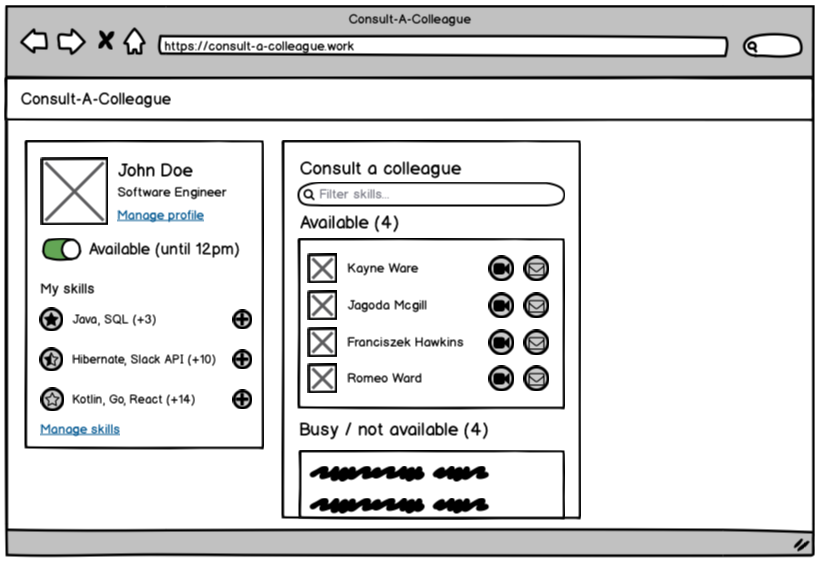
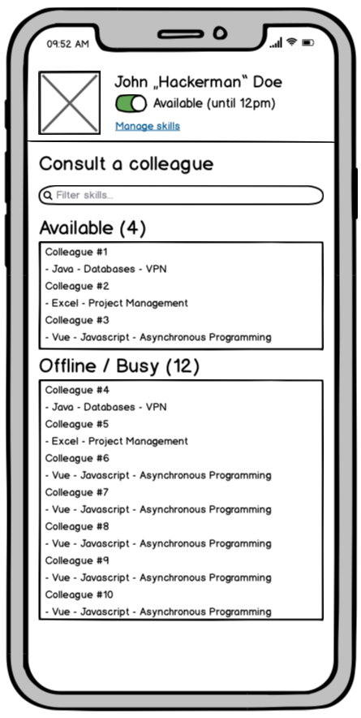

# Consult-a-Colleague

This repo presents the general idea of Consult-a-Colleague.

## Links

1. DevPost project (TODO)

## Idea

Consult-a-Colleague is a tool that makes it easy to find colleagues that are
available for help and have the required skills to help effectively.

People sign up, join their team and fill out some user information. The most important part is
the skill section, where users state their own skill set in three levels (eg. bronze, silver,
gold / fundamentals, advanced, expert).

When on the site, they can set their own status ("available" / "not available") and browse
a list of available colleagues which can be filtered by skills.

The main purpose is enabling collaboration (matching colleagues), not the collaboration itself.
Companys already have their preferred tools for communication (Slack, Rocket.Chat,
Microsoft Teams, Skype, Google Meet, etc.), therefore establishing a new communication channel
is a waste of effort.

## Technology

### Required components

- Spring Boot (WebApp) Backend
- H2 / PostgreSQL database
- React Frontend

## Optional components

Integrations / Add-ons for quick access & status updates.

- Slack integration
- Chrome extension
- Further ideas

## Mockups

Thease are early drafts to illustrate the tool.

